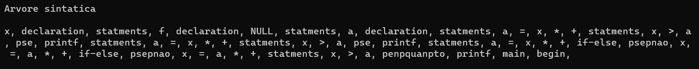
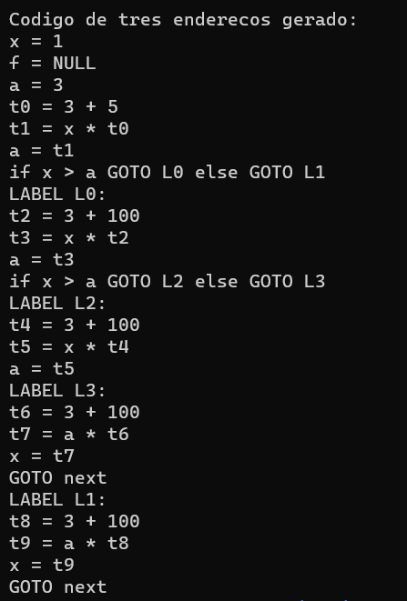

# Sobre 

## Representação intermediária

Nosso compilador ainda não executa código, no lugar, ele mostra na saída representações intermediárias geradas durante a análise do código fonte do programa. Nosso compilador mostra a árvore de derivação gerada pela análise semântica, e ao final geramos um código de três endereços para o programa fonte.

Vamos mostrar um exemplo gerado pelo código abaixo:

````
pinpteipro main() {
    pinpteipro x=1;
    prepal f;
    pinpteipro a=3;
    a = x * 3 + 5;
    pse(x>a) {
        pespcrepva("Ola linguagem P!");
        a = x * 3 + 100;
        pse(x>a) {
            pespcrepva("Ola condicoes!");
            a = x * 3 + 100;
        }
        psepnao {
            x = a * 3 + 100;
        }
    }
    psepnao {
        x = a * 3 + 100;
    }

    penpquanpto(x>a) {
        pespcrepva("Infinito!");
    }
}
```

<p align="center">
  
  
</p>

## Erros

Tipos de erros:

1. Erros sintáticos
2. Erros semânticas
  - Vaiáveis não declaradas
  - Múltiplas declarações de variáveis
  - Váriáveis não podem ter o mesmo nome de palavras reservadas
  - Verificação de tipos de variáveis